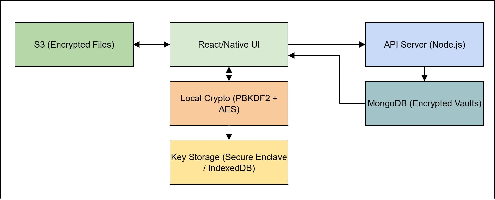

# Technical Specification Document: ShyPass (Password Manager App)

---

## 1. Overview

ShyPass is a cross-platform secure password manager that allows users to store, manage, and retrieve their credentials across devices. It features end-to-end encryption, biometric access (on mobile), and secure vault sharing.

---
## 2. Definitions

| Term                  | Definition                                                                 |
|-----------------------|----------------------------------------------------------------------------|
| AES-256               | Advanced Encryption Standard using 256-bit keys. It is a strong symmetric encryption standard. |
| PBKDF2                | Password-Based Key Derivation Function 2. It is used to derive encryption keys from passwords. |
| JWT                   | JSON Web Token. A compact, URL-safe means of representing claims between the frontent and API server securely.   |
| 2FA / TOTP            | Two-Factor Authentication / Time-based One-Time Password.
| Vault                 | A secure collection where encrypted items like passwords are stored.       |
| Encrypted Data        | Information transformed using an algorithm to prevent unauthorized access. |
| Frontend              | The user-facing part of the application (UI).                              |
| Backend               | Server-side logic and APIs that power app features.                        |
| API                   | Application Programming Interface. A mechanism that enables communication between the frontend and backend.   |
| MongoDB               | A NoSQL document database used to store user data and vault items.         |
| S3                    | Amazon Simple Storage Service. A object storage used for storing encrypted file attachments. |
| Node.js               | JavaScript runtime environment used for backend development.               |
| React / React Native  | JavaScript libraries for building web and mobile interfaces respectively.  |
| OAuth                 | Open standard for access delegation, used here for Google login.           |
| GitHub Actions        | CI/CD automation platform used to build, test, and deploy the app.         |
| Firebase              | Mobile and web app development platform used here for mobile distribution. |
| Keystore / Keychain   | Secure storage provided by Android/iOS for storing cryptographic keys.     |
| HTTPS                 | Hyper Text Transfer Protocol Secure.              |
| Zero Knowledge        | Design principle where server cannot access sensitive data in plaintext.   |
| TOTP                  | Time-based One-Time Password algorithm used for 2FA.                       |
| Docker                | Tool for containerizing apps for consistent deployment across environments.|
| WebSocket             | Protocol enabling real-time communication between clients and servers.     |

## 3. Core Features
  

### 3.1 Vault Management  
SecurePass allows users to create and manage a personal vault containing encrypted items such as passwords, secure notes, and credit card information. Each entry is encrypted on the client device before being stored in the backend.

### 3.2 Cross-Platform Sync  
The application supports seamless synchronization of vault data across web and mobile devices. This ensures that users have up-to-date access to their credentials on any platform, facilitated by secure APIs and token-based authentication.

### 3.3 End-to-End Encryption  
All user data is protected with AES-256 encryption performed on the client side. SecurePass operates on a zero-knowledge principle, meaning plaintext data is never accessible to the server. The master password is never transmitted.

### 3.4 Biometric Unlock (Mobile)  
On supported mobile devices, users can unlock their vault using biometric authentication methods such as Face ID or fingerprint scanning. This enhances security while providing convenience for quick access.

### 3.5 Vault Sharing  
SecurePass includes a vault sharing mechanism that enables users to share specific credentials with trusted contacts. Shared entries are encrypted using shared keys and permissions can be configured for view or edit access.

### 3.6 Password Generator  
A built-in password generator helps users create strong, random passwords that meet specified criteria (e.g., length, symbols, numbers). This tool encourages good security hygiene.

### 3.7 Auto Logout & Timeout  
For security, SecurePass includes automatic logout functionality after a period of user inactivity. This minimizes the risk of unauthorized access on unattended devices.

### 3.8 Emergency Access  
Users can designate emergency contacts who can request access to the vault after a defined waiting period. This feature is useful in scenarios where users become incapacitated.

### 3.9 Offline Access (Mobile)  
The mobile application caches encrypted data locally, allowing users to access their vault even without an internet connection. Changes made offline are synced once the device reconnects.

### 3.10 Two-Factor Authentication (2FA)  
SecurePass supports TOTP-based two-factor authentication, adding an extra layer of security during login. Users can enable 2FA using any compatible authenticator app.

---

## 4. Technology Stack

| Layer          | Technology                                        |
|----------------|---------------------------------------------------|
| Frontend       | React.js (Web), React Native (Mobile)             |
| Backend        | Node.js + Express                                 |
| Database       | MongoDB (vaults encrypted at-rest)                |
| Encryption     | AES-256 + PBKDF2 key derivation                   |
| Authentication | JWT + Google OAuth + TOTP (2FA)                   |
| Hosting        | AWS EC2 + MongoDB Atlas                           |
| Storage        | AWS S3 (for encrypted attachments)                |
| CI/CD          | GitHub Actions + Firebase App Distribution        |

---

## 5. Software Architecture

### 5.1. **Frontend (React for Web, React Native for Mobile)**
The Frontend serves as the primary interface for users to interact with the app. It lets the user access the login screen, password vault UI, file upload/download modules, and shared vaults.

The User enter their **master password**, which remains safe with it and never transmitted over the network. It also initiates the local key derivation (PBKDF2) and handles AES encryption/decryption. All data are encrypted locally, except for ciphertext which is sent to the backend via HTTPS.

### 5.2. **Local Crypto (AES-256, PBKDF2)**
All cryptographic operations are handled here using a secure platform-native libraries such as WebCrypto, CryptoKit, andd others. The master key is derived from the user’s master password using PBKDF2. Vault entries are encrypted and decrypted using AES-256 which then goes to the Database via API server.

### 5.3. **Key Storage**
Session keys are stored using secure local methods depending on the platform. The key is used for all crypto operations during session. When a session ends, the key gets automatically destroyed and the user must re-authenticate. Key storage methods based on the platform are:

- **Mobile**: iOS Keychain, Android Keystore  
- **Web**: IndexedDB  
- **Desktop**: macOS Keychain, Windows DPAPI  
  

### 5.4. **API Server (Node.js)**
It is a stateless server acting as a secure proxy between the client and storage. The role of the server is to handle user authentication, token issuance (JWT), and vault-related CRUD operations. The data from the frontend goes to the database and back, through this server. All the communications happens nly via HTTPS (TLS 1.2+). It does not decrypt or access plaintext data.

### 5.5. **MongoDB (Encrypted Vault Storage)**
It is the primary database and stores highly valuable data such as Encrypted vault items, User metadata and Audit logs. It receives data from the frontend through the API server and sends back responses through the same server. 

### 5.6. **AWS S3 (Encrypted Attachments)**
Used for uploading and retrieving encrypted files such as ID proofs, notes, secure documents, and much more. The files are encrypted on the client using the user’s derived key. The Backend issues signed S3 URLs which is used for uploading and downloading the file. The files remain encrypted while in transit as well as at rest. The decyprtion of the files also happen in the frontend.

---

## 6. Security Model
 

| Feature           | Description                                               |
|------------------|--------------------------------------------------------------|
| Zero Knowledge   | Server never sees plaintext or master password               |
| End-to-End Crypto| Encryption & decryption happen only on the client side       |
| AES-256          | A Industry standard symmetric encryption for items stored in the vault.      |
| PBKDF2           | A Key derivation to help resist brute-force attack|
| TOTP 2FA         | Adds time-based secondary auth during login                  |
| Secure Storage   | Platform-specific secure key storage (Keychain, Keystore)    |

---

